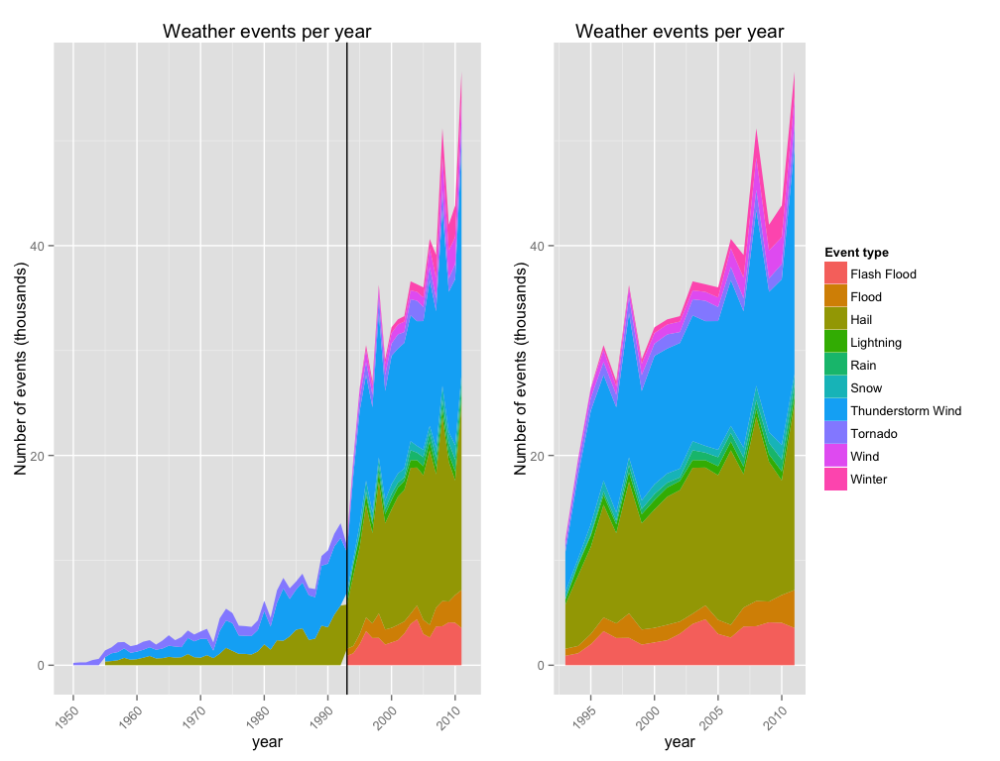
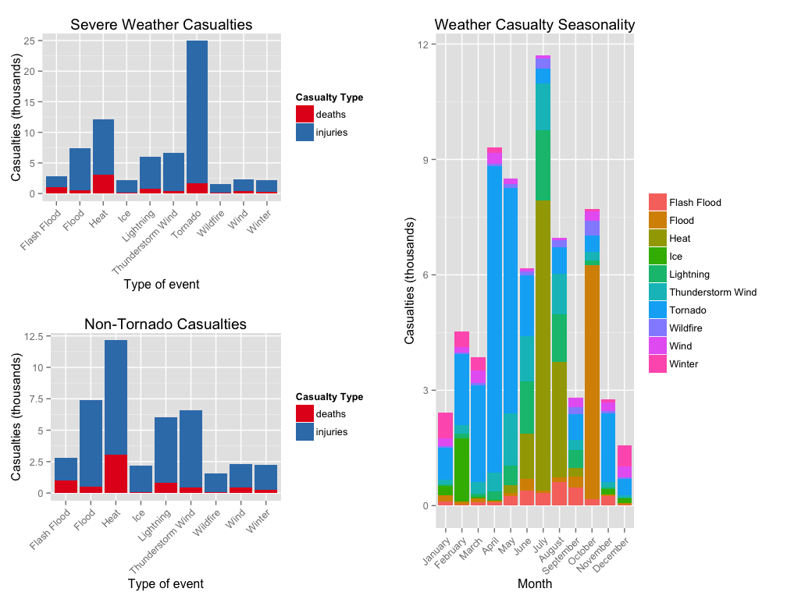

# Economic and Human Consequences of Storms: An Analysis of NOAA Storm Data
Matthew Gast  
May 2015  

# Synopsis

Severe weather affects the population both through direct harm to
individuals in the population, as well as by inflicting economic
damage by harm to both property and crops.  This paper analyzes data
collected by the National Oceanographic and Atmospheric Administration
(NOAA) to assess the harm from severe weather in the United States.

Population harm is measured by casualties, which consist of both
deaths and injuries.  The most dangerous weather event to people is
tornados, followed by heat-related weather.  Severe weather events
have seasonal patterns, with tornados doing the most harm to the
population in the spring (April), heat-related weather doing the most
harm in the summer (July), and flooding doing the most harm in the
fall (October).

The economic consequences of severe weather come from both damage to
property and damage to crops, with most of the total economic damage
coming from property damage.  The main source of crop damage is
drought, followed by floods and hurricanes.  Severe weather events
have seasonal patterns as well, with crop damage peaking late during
the growing season from June through September.  Property damage is
done mainly by floods, with significant contributions from hurricanes
and tornados.  Flood damage is concentrated in January, with tornado
damages coming in the spring (April and May), and hurricane damage in
the late summer and fall (August through October).

# Data Processing

Before performing the analysis, the relevant data was loaded and
preprocessed.  All code that supports this document may be found in
the [Github
repository](https://github.com/matthewgast/RepData-StormProject) for
the project.  To improve the readability of this paper, many
repetitive tasks have been turned into functions, and links to the
full code will be available at GitHub.

1. Environment setup

Several support functions are used in this document, and are contained
in the file [storm-data-support-functions.R](https://github.com/matthewgast/RepData-StormProject/blob/master/storm-data-support-functions.R).
Therefore, to set up the environment, the support code is loaded.
This paper makes use of several R packages to support the analysis in
the document, which are loaded by the `loadPackages()` function.


```r
source("storm-data-support-functions.R")
loadPackages()
```

```
## 
## Attaching package: 'dplyr'
## 
## The following object is masked from 'package:stats':
## 
##     filter
## 
## The following objects are masked from 'package:base':
## 
##     intersect, setdiff, setequal, union
## 
## Loading required package: grid
## Loading required package: RColorBrewer
```

2.  Read data and assess data quality

With the environment set up, data is read by a support function called
`readData()`.  The support function reads in the data from the current
working directory on disk, but performs no processing and simply
returns a data frame with the raw data.  When complete, the raw data
comprises over 900,000 weather events, as seen by the `dim()`
function.


```r
readData <- function (directory) {
# This function reads NOAA weather data from the disk.
#
# Input:  The directory containing the file of weather data.
# Output: A data frame containing the severe weather data set.
    
    cwd <- getwd()
    setwd("/Users/mgast/Dropbox/data-science-specialization/5-reproducible-research/RepData-StormProject")
    raw.df <- read.csv("repdata-data-StormData.csv")
    setwd(cwd)
    raw.df 
}

storm.data.raw <- readData()
dim(storm.data.raw)
```

```
## [1] 902297     37
```

Now that the data is in place, look at the column names in the raw
data.


```r
names(storm.data.raw)
```

```
##  [1] "STATE__"    "BGN_DATE"   "BGN_TIME"   "TIME_ZONE"  "COUNTY"    
##  [6] "COUNTYNAME" "STATE"      "EVTYPE"     "BGN_RANGE"  "BGN_AZI"   
## [11] "BGN_LOCATI" "END_DATE"   "END_TIME"   "COUNTY_END" "COUNTYENDN"
## [16] "END_RANGE"  "END_AZI"    "END_LOCATI" "LENGTH"     "WIDTH"     
## [21] "F"          "MAG"        "FATALITIES" "INJURIES"   "PROPDMG"   
## [26] "PROPDMGEXP" "CROPDMG"    "CROPDMGEXP" "WFO"        "STATEOFFIC"
## [31] "ZONENAMES"  "LATITUDE"   "LONGITUDE"  "LATITUDE_E" "LONGITUDE_"
## [36] "REMARKS"    "REFNUM"
```

For the purpose of this analysis, we care about the following fields:

- `EVTYPE`: The type of weather event, such as a drought, flood, or tornado.
- `BGN_DATE`: The date at which a particular weather event began.  This field is used to study the seasonality of weather events.
- `FATALITIES` and `INJURIES`: together, these two fields give us an indication of the total human cost of storm events.  In this analysis, they will be combined into a single "casualty" number.
- `PROPDMG` and `PROPDMGEXP`: The data set expresses property damage as the combination of a number and an exponent.  For example, US$25,000 is expressed as a value of 25 and an exponent of "K" for thousand.
- `CROPDMG` and `CROPDMGEXP`: Crop damage is expressed in the same manner as property damage.

With a large amount of data, it is important to assess how much of the
data is present.  Most of the data fields in the data set are full,
with only four fields showing an NAs, none of which matter to the
analysis.


```r
countNAs (storm.data.raw)
```

```
##             count
## COUNTYENDN 902297
## F          843563
## LATITUDE       47
## LATITUDE_E     40
```

After deciding which fields are relevant to the analysis, select only
the columns needed.  The EVTYPE, FATALITIES, and INJURIES field are
all in their final form, and therefore, the column names are converted
to lower case letters.  The remaining fields require further
processing in order to assume their final form.  As a hint to the
state of the analysis, fields requiring further processing will retain
their all-capitalized field names.


```r
storm.data <- select(storm.data.raw,EVTYPE,BGN_DATE,FATALITIES,INJURIES,PROPDMG,PROPDMGEXP,CROPDMG,CROPDMGEXP)
names(storm.data) <- c("event","BGN_DATE","deaths","injuries","PROPDMG",
		  "PROPDMGEXP","CROPDMG","CROPDMGEXP")
```

3. Extracting date information

To continue with the analysis, the `BGN_DATE` field will be processed.
The field consists of a day and time at which each individual weather
event began.  For the purpose of seasonal or time series analysis,
only the month and year matter, so extract them from the data using
the date manipulation functions.

The range of time covered by the dataset may be given by looking at
the `min()` and `max()` year in the date range.


```r
storm.data$month <- as.numeric(format(as.Date(storm.data$BGN_DATE, format = "%m/%d/%Y %H:%M:%S"), "%m"))
storm.data$year <- as.numeric(format(as.Date(storm.data$BGN_DATE, format = "%m/%d/%Y %H:%M:%S"), "%Y"))
min(storm.data$year)
```

```
## [1] 1950
```

```r
max(storm.data$year)
```

```
## [1] 2011
```

4. Economic damage fields

The economic damage fields are split into two parts: a number and an
exponent.  Taken together, they describe the damage.  To work with the
economic damage fields, we will need to transform them into a single
number describing the damage.  Begin by looking at the values of the
exponent fields.  Sometimes, the exponent is a number, sometimes is it
a letter, and very occasionally, it is another character entirely.
The `levels()` function will print out a list of all the values a
column takes on to show what kinds of information is contained in the
field.


```r
levels(storm.data$PROPDMGEXP)
```

```
##  [1] ""  "-" "?" "+" "0" "1" "2" "3" "4" "5" "6" "7" "8" "B" "h" "H" "K"
## [18] "m" "M"
```

```r
levels(storm.data$CROPDMGEXP)
```

```
## [1] ""  "?" "0" "2" "B" "k" "K" "m" "M"
```

According to the code book for the data, the exponent fields should be
alphabetic, using the letters K for thousand, M for million, and B for
billion.  In addition to these expected values, there are also
numbers, many blank fields, and the use of dashes, plus signs, and
question marks.  This analysis assumes that if the exponent field is
blank, it means the damage value field needs no further
multiplication.  To consider whether the remaining text values will
affect the analysis, it is possible to look at how often they occur.
As it turns out, very few events use exponents that are dash, plus, or
question mark.


```r
select(subset(storm.data,PROPDMGEXP %in% c("-","+","?")),event,month,year,PROPDMG,PROPDMGEXP)
```

```
##                      event month year PROPDMG PROPDMGEXP
## 188780    BREAKUP FLOODING     5 1995      20          +
## 189001           HIGH WIND    12 1994      20          +
## 192262 FLOODING/HEAVY RAIN     3 1995       2          +
## 198689  THUNDERSTORM WINDS     4 1995       0          ?
## 216755          HIGH WINDS     6 1995      15          +
## 216802             TORNADO     6 1995      60          +
## 225254         FLASH FLOOD     5 1993       0          ?
## 227409         FLASH FLOOD     5 1993       0          ?
## 229327           HIGH WIND    12 1995      15          -
## 232016   THUNDERSTORM WIND     8 1994       0          ?
## 233746                HAIL     9 1995       0          ?
## 233747                HAIL     9 1995       0          ?
## 233748                HAIL     9 1995       0          ?
## 247617  THUNDERSTORM WINDS     7 1995       0          ?
```

```r
select(subset(storm.data,CROPDMGEXP %in% c("-","+","?")),event,month,year,CROPDMG,CROPDMGEXP)
```

```
##                     event month year CROPDMG CROPDMGEXP
## 192467  FLASH FLOOD WINDS     3 1995       0          ?
## 197066 THUNDERSTORM WINDS     2 1993       0          ?
## 197331 THUNDERSTORM WINDS     2 1993       0          ?
## 220300 THUNDERSTORM WINDS     7 1995       0          ?
## 220877  FLOOD/FLASH FLOOD     2 1995       0          ?
## 232901  FLOOD/FLASH FLOOD     8 1995       0          ?
## 242953 THUNDERSTORM WINDS     4 1995       0          ?
```

A few exponent fields are even a number.  The code book does not
describe the values that should be attributed to a number, so this
analysis takes the number as the exponent to a power of 10.  That is,
a "3" in the exponent field means to multiply the value by 10^3, which
is equivalent to treating the exponent as a "K".

The `exponentTranslator()` function is used to translate the exponent
character into a numeric power of 10.  If given a number, it returns
that number.  If given a K for thousands, it returns 3.  If it is
given an M for millions, it returns 6.  If given a B for billions, it
returns 9.  There are a few cases where there is an H for hundreds,
and the function returns 2.  All other values cause the function to
return a 1.

To translate the raw data (`PROPDMGEXP` and `CROPDMGEXP`) into
numerical values (`propExponent` and `cropExponent`), simply apply the
`exponentTranslator()` function to the raw data.  After conversion,
compare the values in the raw data to the translated data to ensure
that the fields are translated correctly.  For example, in property
damage, there are 11,330 events with an exponent of "M", 7 events with
an exponent of "m", and 4 events that use an exponent of "6".  All of
these exponents translate to millions of dollars.  When translated,
there are 11,341 events that have the exponent of 10^6, which matches
identically.  While looking at the tables of exponent values, it is
possible to get an idea of the magnitude of the impact of severe
weather.  Property damage events with billions of dollars in damage
are significantly more common than high-value crop damage events.


```r
propExponent <- mapply(exponentTranslator,storm.data$PROPDMGEXP)
cropExponent <- mapply(exponentTranslator,storm.data$CROPDMGEXP)
table(storm.data$PROPDMGEXP)
```

```
## 
##             -      ?      +      0      1      2      3      4      5 
## 465934      1      8      5    216     25     13      4      4     28 
##      6      7      8      B      h      H      K      m      M 
##      4      5      1     40      1      6 424665      7  11330
```

```r
table(propExponent)
```

```
## propExponent
##      0      1      2      3      4      5      6      7      8      9 
##    216 465973     20 424669      4     28  11341      5      1     40
```

```r
table(storm.data$CROPDMGEXP)
```

```
## 
##             ?      0      2      B      k      K      m      M 
## 618413      7     19      1      9     21 281832      1   1994
```

```r
table(cropExponent)
```

```
## cropExponent
##      0      1      2      3      6      9 
##     19 618420      1 281853   1995      9
```

With exponents now available in numeric form, translate the damage
value and exponents into total damage fields with a pipeline.


```r
storm.data <- storm.data %>%
    cbind(propExponent,cropExponent) %>%
    mutate(propertyDamage=PROPDMG*10^propExponent,
           cropDamage=CROPDMG*10^cropExponent)

rm(propExponent)
rm(cropExponent)
```

5. Event simplification

The coding of events in the storm data is somewhat haphazard.  There
are 985 event types, but a casual inspection reveals many
inconsistencies.  For example, a search through the event types
determines that there are over 100,000 thunderstorm events, and those
events have 82 different text descriptions.


```r
length(unique(storm.data$event))
```

```
## [1] 985
```

```r
name.contains.tstorm <- grepl("THUNDERSTORM",storm.data$event,ignore.case=TRUE)
sum(name.contains.tstorm)
```

```
## [1] 109572
```

```r
length(unique(storm.data[name.contains.tstorm,]$event))
```

```
## [1] 82
```

To shrink the event types to a manageable size, we begin by converting
all text to upper case to avoid case mismatches between otherwise
identical events.  The function `topEvents` prints out the top 10
events and the number of times they appear in the database.  Three of
the top 10 events have essentially identical descriptors: "TSTM WIND",
"THUNDERSTORM WIND", and "THUNDERSTORM WINDS".


```r
storm.data$event <- toupper(storm.data$event)
topEvents(storm.data,10)
```

```
## 
##               HAIL          TSTM WIND  THUNDERSTORM WIND 
##             288661             219942              82564 
##            TORNADO        FLASH FLOOD              FLOOD 
##              60652              54277              25327 
## THUNDERSTORM WINDS          HIGH WIND          LIGHTNING 
##              20843              20214              15754 
##         HEAVY SNOW 
##              15708
```

After inspecting the event names, several combinations to the data are
made.  there are over 900 event names in the database, the combination
process is quite repetitive.  The function `mergeEvents()` is defined
to combine several types of events together.  As arguments, it takes
the data frame, a new container event, and the list of events that
shoudl be written into the new container event.  It is defined in the
[storm-data-support-functions.R](https://github.com/matthewgast/RepData-StormProject/blob/master/storm-data-support-functions.R).
To merge together the events for the purpose of analysis, this paper
defines the function `simplifyEvents`, which is [available in the
GitHub
repository](https://github.com/matthewgast/RepData-StormProject/blob/master/simplifyEvents.R).
`simplifyEvents()` is a function that repeatedly calls `mergeEvents()`
to consolidate event types.  As a result of the simplification, events
related to rain and winter weather appear in the top 10 event types,
and a substantial reduction in the number of unique event types is
achieved.


```r
source("simplifyEvents.R")
storm.data <- simplifyEvents(storm.data)
topEvents(storm.data,10)
```

```
## 
## THUNDERSTORM WIND              HAIL           TORNADO       FLASH FLOOD 
##            324728            288829             60684             55039 
##             FLOOD              WIND            WINTER              SNOW 
##             30138             26013             19693             16610 
##         LIGHTNING              RAIN 
##             15755             11854
```

```r
length(unique(storm.data$event))
```

```
## [1] 419
```

The final step in processing event types is to reformat event types as
mixed-case names with the help of a function that rewrites even
types to have an initial capital letter in each word.


```r
storm.data$event <- sapply(storm.data$event, initialCap)
```

6. Selecting a subset of years

The code book describing the data states that data is more complete in
later years.  As a rudimentary assessment of data completeness,
consider the types of severe weather events defined over time.  To get
a graphical representation of the data, first plot the top severe
weather events over the life of the data set to determine if there is
a subset of data that makes sense to study intensively.  To count up
the types of events, an R pipeline is defined that counts the number
of events of each type per year with the `summarize()` function in
dplyr.  A second pipeline derives the top ten events by count, and the
top ten events are used as input into plotting.  This basic analysis
focuses on the ten most common types of events in the data set, which
include flash floods, floods, hail, lightning, rain, snow,
thunderstorm winds, tornados, wind, and winter weather.


```r
event.count <- storm.data %>%
  group_by(event,year) %>%
  select(event,year) %>%
  summarize(count=n())

top10.events <- event.count %>%
  group_by(event) %>%
  summarize(count=sum(count)) %>%
  arrange(desc(count)) %>%
  head(10)

top10.eventnames <- top10.events$event
top10.events.by.year <- filter(event.count,event %in% top10.eventnames)
```

To assess the quality of recordkeeping, plot the number of events per
year of the major types.  In left panel of the plot, it is apparent
that tornado, thunderstorm, and hail data has been collected since the
1950s.  However, starting in the early 1990s, data became much more
comprehensive.  This paper divides the data into a "historic" era and
a "modern" era in 1993, denoted by a vertical line on the left panel.
The remainder of the analysis is restricted to post-1993 data because
it allows for direct comparison between storm types.  If the entire
data set were to be used, thunderstorms and tornados would be
overrepresented because the historic data has much more data on
thunderstorms.  The following panel of plots shows the overall data
set with a vertical line in 1993, and then the post-1993 data in the
right plot.


```r
eventcount.base.g <- ggplot(top10.events.by.year, aes(x = year,
    	       y = count,
			       fill=event)) +
     geom_area(stat='identity') +
     xlab("year") +
     theme(axis.text.x = element_text(angle=45, hjust=1)) +
     ylab("Number of events (thousands)") +
     scale_y_continuous(labels=thousands) +
     scale_x_continuous(breaks=seq(1950,2010,10))

eventcount.g <- eventcount.base.g +
                geom_vline(aes(xintercept=1993)) +
                guides(fill = FALSE) +
                ggtitle("Weather Events (full set)")

eventcount.modern.g <- eventcount.base.g +
                       scale_x_continuous(limits=c(1993,2011)) +
                       labs(fill = "Event type") +
                       ggtitle("Weather Events (post-1993)")
```

```
## Scale for 'x' is already present. Adding another scale for 'x', which will replace the existing scale.
```

```r
grid.arrange(eventcount.g,eventcount.modern.g,ncol=2)
```

```
## Warning in loop_apply(n, do.ply): Removed 119 rows containing missing
## values (position_stack).
```

 

Based on the right panel plot, this analysis restricts itself to data
in 1993 and later, which is still most of the data.  Even after
discarding the historical data prior to 1993, almost 80% of the data
remain for analysis.


```r
storm.data <- filter(storm.data,year>=1993)
dim(storm.data)
```

```
## [1] 714738     14
```

7. Simplify data

The simplification step is to drop extraneous columns of
raw data, retaining only the event type, casualty counts, damage
information, and the extracted month and year.  Finally, the column
order is rewritten so that related columns are next to each other to
improve readability.


```r
storm.data <- storm.data %>%
  select(event,deaths,injuries,propertyDamage,cropDamage,month,year) %>%
  mutate(totalDamage=propertyDamage+cropDamage,
         casualties=deaths+injuries)
```

As an auxiliary summary, a second data frame is created that
aggregates the effects of each type of weather event.  When
aggregating events, we only wish to aggregate economic damage and
casualty data, and it does not make sense to aggregate month and year
numbers.


```r
effect.by.event <- aggregate (cbind(propertyDamage,
                                    cropDamage,
                                    totalDamage,
                                    deaths,
                                    injuries,
                                    casualties) ~ event,
                              data=storm.data,
                              FUN=sum)
```

8. Casualty data processing

With the the effects of events calculated and tabulated, it is
possible to focus numerical analysis on the causes of casualties.
This analysis focuses only on the top ten causes of casualties to
provide information on the most likely severe weather events to cause
human harm.

The first step in the analysis is to sort the weather events by the
casualty count, and select only the top ten.  The names of those
events are saved for creating the monthly reports, and the top ten
casualty events are transformed from a "wide" format into a "long"
format more suitable for plotting with the `melt()` function.  Because
the tornado event type is dominant, a second set of casualty data is
calculated excluding tornado events for clarity.


```r
casualties.by.event <- effect.by.event %>%
    arrange(desc(casualties)) %>%
    select(event,deaths,injuries) %>%
    head(10)

top10.casualty.event <- casualties.by.event$event
long.format.casualties <- melt(casualties.by.event)
```

```
## Using event as id variables
```

```r
nontornado.casualties <- tail(casualties.by.event,n=9)
long.format.nontornado.casualties <- melt(nontornado.casualties)
```

```
## Using event as id variables
```

```r
monthly.casualties <- storm.data %>%
  filter(event %in% top10.casualty.event) %>%
  group_by(event,month) %>%
  summarize(deaths=sum(deaths),injuries=sum(injuries),casualties=sum(casualties)) %>%
  select(event,month,deaths,injuries,casualties)
```

9.  Damage data processing

Processing of damage data is performed to make it easier to generate
similar graphs for economic damage.  The top ten events are selected
by sorting the aggregated event effects and selecting the first ten
events when the list is sorted in descending order by total damage.
Plotting data works much better in the "long" format where there are
more rows than columns, so creating the monthly data is best done by
aggregating rows of property damage and rows of crop damage into one
data frame.


```r
damage.by.event <- effect.by.event %>%
   arrange(desc(totalDamage)) %>%
   select(event,cropDamage,propertyDamage) %>%
   head(10)

top10.damage.events <- damage.by.event$event
long.format.damage <- melt(damage.by.event)
```

```
## Using event as id variables
```

```r
monthly.damage <- storm.data %>%
   filter(event %in% top10.damage.events) %>%
   group_by(event,month) %>%
   summarize(Property=sum(propertyDamage),Crop=sum(cropDamage)) %>%
   melt(measure=c("Property","Crop"))
names(monthly.damage) <- c("event","month","type","damage")
```

# Results

The results of this analysis are presented in two parts, each
answering a separate research question.

## Research Question 1: Human Effect of Weather Events 

This section of the paper answers the question: *Across the United
States, which types of events (as indicated in the EVTYPE variable)
are most harmful with respect to population health?*

To answer this question, this section of the paper graphs casualty by
storm type, but only for the top ten severe weather event types, as
measured by casualties.  Tornados are dominant in this category, with
almost ten times the casualties as the next highest event type.
Finally, this paper analyzes the seasonal effects of different types
of weather events.

Many types of severe weather are seasonal.  To search out the annual
patterns, the monthly sums are graphed to find patters.  Not surpri
it is possible to sum up casualties on a monthly basis
throughout the data set.  To avoid having an unwieldy number of
weather causes, this analysis is done only for the top ten events that
cause casualties.

For readability, the casualty axis in these plots is scaled by the
`thousands` function in `storm-data-support-functions.R`.


```r
casualties.g <- ggplot(long.format.casualties, aes(x = event,
			       y = value,
			       fill=variable)) +
     geom_bar(stat='identity') +
     xlab("Type of event") +
     theme(axis.text.x = element_text(angle=45, hjust=1)) +
     ylab("Casualties (thousands)") +
     scale_y_continuous(labels=thousands) +
     ggtitle("Severe Weather Casualties") +
     scale_fill_brewer(palette="Set1",label=c("deaths","injuries")
                      ) +
     labs(fill = "Casualty Type")

nontornado.casualties.g <- ggplot(long.format.nontornado.casualties, aes(x = event,
  		       y = value,
			       fill=variable)) +
     geom_bar(stat='identity') +
     xlab("Type of event") +
     theme(axis.text.x = element_text(angle=45, hjust=1)) +
     ylab("Casualties (thousands)") +
     scale_y_continuous(labels=thousands) +
     ggtitle("Non-Tornado Casualties") +
     scale_fill_brewer(palette="Set1",label=c("deaths","injuries")
                      ) +
     labs(fill = "Casualty Type")

casualty.seasons.g <- ggplot(monthly.casualties,aes(
				x=reorder(month.name[month],month),
				y=casualties,
				fill=event)
			     ) +
       geom_bar(stat='identity') + 
       theme(legend.title=element_blank(),
             axis.text.x=element_text(angle=45, hjust=1)
             ) +
       xlab("Month") +
       ylab("Casualties (thousands)") +
       scale_y_continuous(labels=thousands) +
       labs(fill="Weather Type") +
       ggtitle("Weather Casualty Seasonality")
```

From the casualty panel plot below, it is apparent that the deadliest
event type is heat, though tornados cause many more injuries than
heat-related events.  Both floods and flash floods make the list of
harmful events, with flash flooding more likely to kill, and flooding
much more likely to cause injuries.  There is a definite seasonal
nature to the casualty data, with tornados doing damage in the spring,
giving way to heat in the summer.


```r
grid.newpage()
pushViewport(viewport(layout=grid.layout(2,2)))
print(casualties.g,vp=viewport(layout.pos.row=1,layout.pos.col=1))
print(nontornado.casualties.g,vp=viewport(layout.pos.row=2,layout.pos.col=1))
print(casualty.seasons.g,vp=viewport(layout.pos.row=1:2,layout.pos.col=2))
```

 

## Research Question 2: Economic Consequences of Weather

The research question answered in this section of the paper is:
*Across the United States, which types of events have the greatest
economic consequences?*

Economic consequences are divided into damage to property and damage
to crops.  In the top ten economic damage-causing events, property
damage totals $360 billion, while crop damage is only $42 billion.  Of
the top ten damage-causing events, only drought causes more damage to
crops than property.


```r
damage.g <- ggplot(long.format.damage, aes(x = event,
			       y = value,
			       fill=variable)) +
     geom_bar(stat='identity') +
     xlab("Type of event") +
     theme(axis.text.x = element_text(angle=45, hjust=1)) +
     ylab("US$ Damage (billions)") +
     scale_y_continuous(labels=billions) +
     ggtitle("Severe Weather Economic Damage") +
     scale_fill_brewer(palette="Set1",label=c("Crop","Property")
                      ) +
     labs(fill = "Damage Type")
```

Deriving the seasonal nature of economic damage requires a bit more
work.  The individual observations are restricted to only the top ten
events as measured by economic impact.  These events are then divided
into property or crop damage so that both can be plotted on a monthly
basis to determine seasonal flows.


```r
damage.seasons.g <- ggplot(monthly.damage,aes(
  			x=reorder(month.name[month],month),
				y=damage,
				fill=event)
				) +
       facet_grid(type ~ ., scales="free") +
       labs(fill="Weather Type") +
       geom_bar(stat='identity') + 
       theme(legend.title=element_blank(),
	     axis.text.x=element_text(angle=45, hjust=1)) +
       xlab("Month") +
       ylab("Property Damage (billion USD)") +
       scale_y_continuous(labels=billions) +
       ggtitle("Damage Seasonality")
```

From the graphs, the leading cause of property damage is floods,
followed by hurricanes and storm surges, and tornados.  Crop damage is
due mainly to droughts and floods, with somewhat smaller contributions
from hurricanes, ice, and hail.

As with casualties, economic damage has seasonal flows.  Spring
property damage in April and May is caused by tornados and floods,
while fall property damage in August through October is caused by the
peak of hurricane and storm surge.  Crop damage is caused mainly
during the summer, which is not surprising given the agricultural
growing season.  Both droughts and floods have similar peak seasons in
June through September.


```r
grid.newpage()
pushViewport(viewport(layout=grid.layout(1,2)))
print(damage.g,vp=viewport(layout.pos.row=1,layout.pos.col=1))
print(damage.seasons.g,vp=viewport(layout.pos.row=1,layout.pos.col=2))
```

 

# Further research

Future analyses of this data set could study the average casualty or
economic damage per individual storm event.  For example, tornadoes
taken as a whole cause more casualties than hurricanes, but an
individual hurricane causes significantly greater damage than an
individual tornado.  It may also be possible to compare total damages
to the size of either the national population with census data, or to
the national economy by using economic statistics to adjust economic
damages for inflation.
